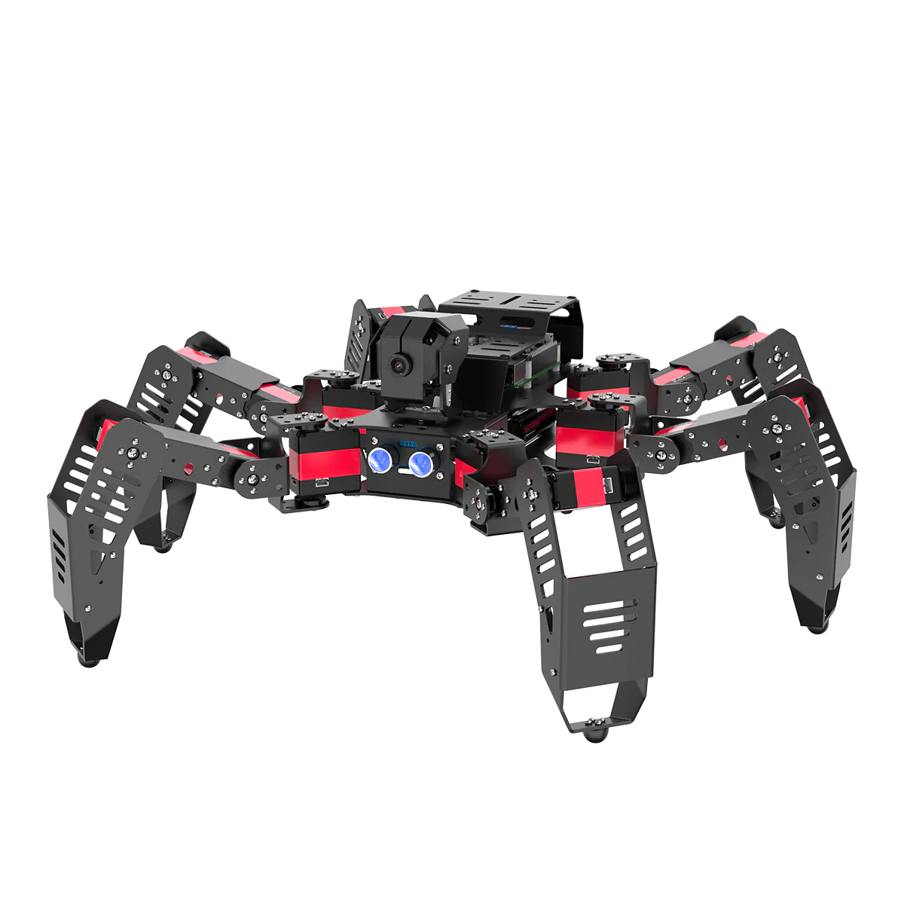

# 🕷️ SRG ENSAM AGADIR Competition - Spider Robot Project 🕷️

This document outlines the accomplishments and technical details of our spider robot developed for the **SRG ENSAM AGADIR** competition.

## 🚀 Achievements Overview

Our team successfully implemented advanced functionalities, enabling the spider robot to perform complex tasks in real-time environments:

### 1. 👁️ Image Detection & Processing
- Utilized **OpenCV** and AI models to detect and recognize objects.
- Real-time image capture and processing for autonomous navigation.

### 2. 🎨 Color Extraction
- **Red**: Identification of target markers or danger zones 🔴.
- **Green**: Identification of safe paths or task completion zones 🟢.
- **HSV Filtering**: Robust detection under varying light conditions.

### 3. 📐 Shape Recognition
- **Square**: Detection of specific competition containers ⬛.
- **Triangle**: Identification of direction signs or checkpoints 🔺.

### 4. 📲 QR Code Processing
- Integrated scanner to decode instructions or log data instantly.

---

## 🛠️ Materials & Hardware
- **Controller**: Raspberry Pi 4B (4GB RAM) 🍓.
- **Actuators**: 18x LX-224HV High-voltage Serial Bus Servos.
- **Vision**: 2DOF High-definition Camera 📷.
- **Sensors**: Ultrasonic distance sensor for obstacle avoidance 🦇.
- **Power**: 11.1V 2500mAh High-voltage Lipo Battery 🔋.

## 🔌 Circuit & Architecture
- **Central Hub**: Raspberry Pi connected to a dedicated Servo Expansion Board.
- **Connectivity**: Servos daisy-chained via serial bus to minimize wiring complexity.
- **Communication**: I2C for ultrasonic sensor and USB/CSI for the camera module.

## ⚙️ Methodology
1. **Kinematics**: Inverse kinematics used for smooth 6-legged gait control.
2. **Vision Pipeline**: Frame capture -> HSV conversion -> Gaussian Blur -> Contour Detection -> Shape/Color filtering.
3. **Control Loop**: Real-time feedback from sensors adjusting the walking gait dynamically.

---

---

## 📁 Project File Structure

### Root Directory Files
- **README.md** - Main project documentation and overview
- **ENGINEERING.md** - Detailed engineering documentation and technical specifications
- **INTEGRATION_GUIDE.md** - Integration instructions and setup guide
- **MASTER.ino** - Main Arduino sketch for the Raspberry Pi control system
- **cam-flash.ino** - Camera flash control Arduino sketch
- **laptop_control.py** - Python script for laptop-based remote control interfacing
- **robot_ctrl.py** - Main Python module for robot control logic and command interface
- **vision_engine.py** - Computer vision module using OpenCV for image processing and object detection
- **testing.py** - Test suite for validating robot functionality and vision algorithms
- **image.png** - Project image/diagram
- **hhhh.html** - HTML documentation or test file
- **.python-version** - Python version specification file
- **.gitignore** - Git ignore rules for version control
- **.git/** - Git repository folder

### /esp/ Folder - ESP/Arduino Sketches
Contains embedded system code for distributed controllers:
- **master.ino** - Master controller sketch for main ESP board
- **cam.ino** - Camera module control sketch
- **camera_color_detector.ino** - Specialized color detection sketch for camera operations
- **spider_master.ino.bak** - Backup of original spider master controller sketch

### /server/ Folder - Server-Side Code
- **color_detector.py** - Server-side color detection algorithm and image processing

### /__pycache__/ Folder
Python cache directory for compiled bytecode

---

## 🔧 Quick Reference: File Purposes

| File | Purpose |
|------|---------|
| vision_engine.py | Core computer vision pipeline |
| robot_ctrl.py | Robot movement and control commands |
| color_detector.py | Color detection logic for navigation |
| master.ino | Primary control firmware |
| laptop_control.py | Remote control interface |
| testing.py | Automated testing suite |

---

*Developed with passion for the SRG ENSAM AGADIR Robotics Competition.*